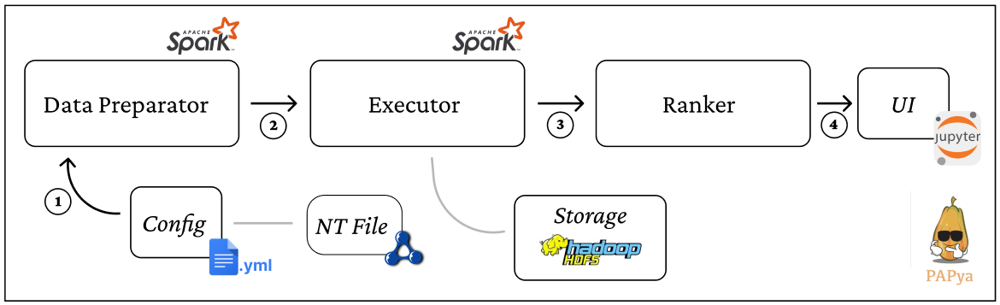

# PAPyA

Prescriptive Performance Analysis  in Python Actions 

This library provides prescriptive analysis for the complex solution space of (RDF relational schema, Partitioning, and Storage Formats) that emerges with querying large RDF graphs over Relational Big Data (BD) System, e.g., Apache Spark-SQL.

| Questions | True  | False  | Description |
| :---:   | :-: | :-: | :-: |
| Does the resource break new ground? |  | :heavy_check_mark: | This work is derived from previous paper |
| Does the resource fill an important gap? | :heavy_check_mark: |  | This system help reduce the time needed to perform a prescriptive performance analysis of BD engine|
